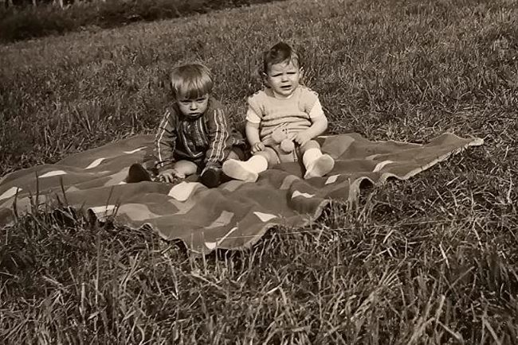
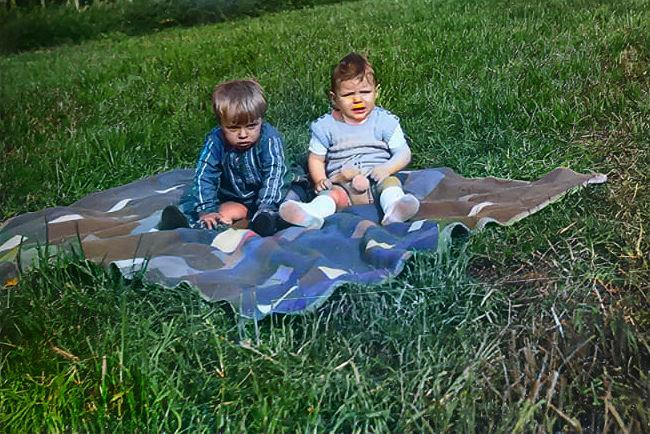

# colorAIze

colorAIze is an artificial intelligence that specialises in converting black and white or sepia photos into colour images.

Old Image           |  Colorized Image
:-------------------------:|:-------------------------:
  |  

## Installation
The model can only be run on Linux. Under Windows, I recommend the WSL 2 with Ubuntu 22. You can find more information on installing the WSL [here](https://learn.microsoft.com/de-de/windows/wsl/install).


### Prepare the python virtual environment
```bash
python -m venv colorAIze_venv

# activate the virtual environment
source ./colorAIze_venv/bin/activate

# install the necessary packages
pip install -r requirements.txt
```


## Usage
ColorAIze can be used via the command line. You can display the help with:

```bash
python3 colorize.py -h
```

|   Option	|   Description	|
|---	|---	|
|   --weight	|   Path to the model weight used for the colorization	|
|   --weights	|   Path to the model weights used for the colorization (Produces multiple images)	|
|   --image_path	|   Path to the image	|
|   --image_url	|   Url to the image	|
|   --video_path	|   Path to the video	|

The generated images end up in the colorized folder

### Example

Convert a local image
```
python3 colorize.py --weight ./weights/2024-01-19_04-00-03.pt --image_path ./assets/old_image.jpg
```

## Training

The entire Imagenet data set was used for the training. You can download it [here](https://www.kaggle.com/c/imagenet-object-localization-challenge/data).

Then adjust the paths for the training data in the train.py file.

You can start the training with the following command:

```bash
python3 train.py
```

The models are saved in the models folder. If this does not exist, it is created. The loss of the training session is also saved as a csv file.